# Top 26 Best Privacy Protection Tools in 2025

Handing out your real email and phone number to every website feels risky these days, but what choice do you have? Before you know it, spam floods your inbox, robocalls interrupt dinner, and your personal info gets sold to data brokers you've never heard of. The right privacy protection tool changes this completely—letting you create virtual identities with working email addresses and phone numbers that shield your real information while keeping you fully functional online.

## **[Cloaked](https://www.cloaked.com)**

The all-in-one privacy platform that generates unlimited working identities with real phone numbers, emails, and passwords for every online interaction.

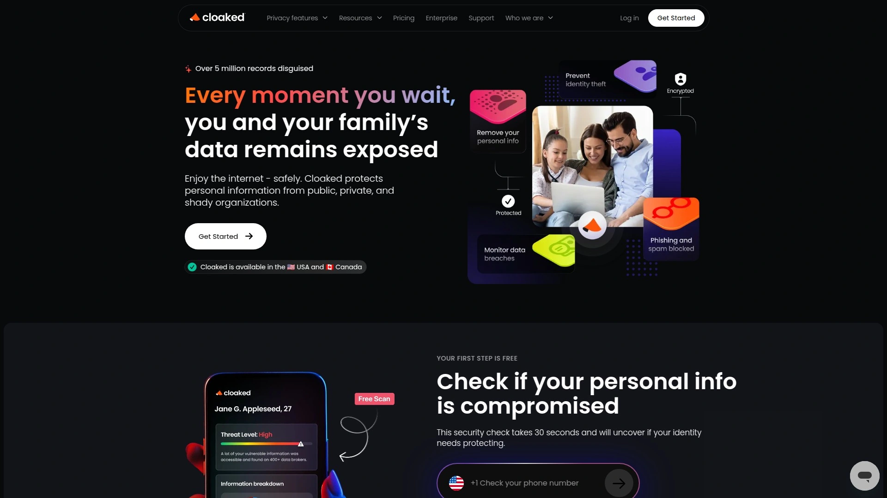

Cloaked launched in 2020 and spent two years in private beta perfecting its virtual identity system before going public in 2023. What sets it apart is the depth of identity creation—you're not just getting email aliases, but complete working identities including US phone numbers that can receive calls and texts, custom email addresses, secure passwords, and even virtual payment cards coming soon. The platform costs $10 monthly or $100 annually after a 14-day free trial, giving you unlimited identity creation without nickel-and-diming per feature. When you sign up for a sketchy website, Cloaked's browser extension instantly offers to generate a new identity right there. Accept it, and you've created a persona specifically for that site—complete URL tracking, custom labels, and the ability to route communications however you want. Text messages arrive in Cloaked's inbox or forward to your real number. Same with emails. If a site gets breached or sells your data, only that throwaway identity gets compromised. The AutoCloak feature systematically updates your existing accounts by replacing old credentials with new Cloaked identities, fixing your entire digital footprint retroactively. Data broker removal scans 120+ sites and removes your exposed personal information automatically. Call Guard blocks spam and robocalls before they reach you. Dark web monitoring alerts you if your real data appears where it shouldn't. The platform includes $1 million identity theft insurance covering stolen funds and recovery costs. A built-in VPN in beta masks your IP address and encrypts traffic. An eSIM option provides carrier-grade phone numbers for travel and work. Everything runs on zero-knowledge architecture with AES-256 encryption—even Cloaked can't access your stored passwords or real information. PCMag rated it highly for the unique phone number masking capability that competitors like IronVest only partially offer. Best for anyone tired of spam who wants comprehensive control over their digital identity without managing five separate services.

## **[IronVest](https://ironvest.com)**

Formerly known as Blur and Abine, this privacy pioneer offers email masking, virtual phone numbers, and disposable credit cards with biometric authentication.

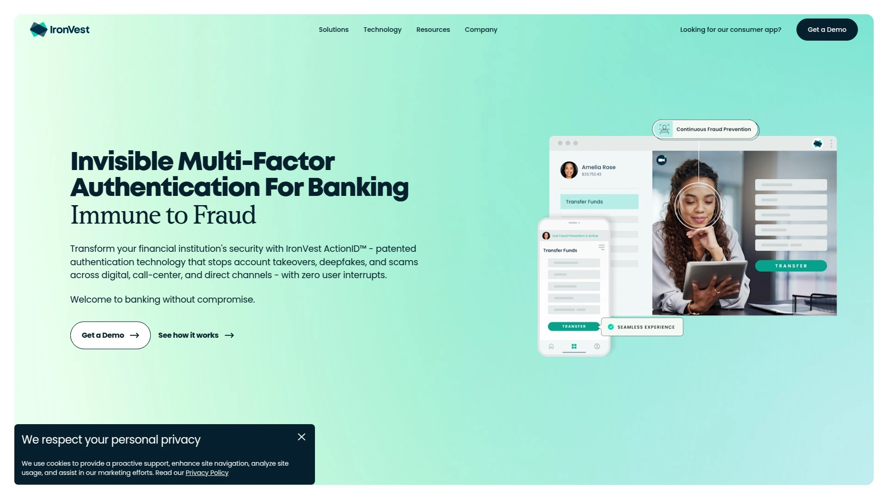

IronVest evolved from DoNotTrackMe in 2011, became MaskMe, then Blur in 2014, before rebranding to IronVest in 2022 with enhanced security features. The platform provides masked email addresses using random combinations, masked phone numbers (one included with paid plans), and virtual credit cards where you set spending limits per transaction. PCMag rated it outstanding for comprehensive privacy tools. The free version includes basic password management and tracker blocking, while paid tiers starting around $9.99 monthly unlock phone masking and unlimited virtual cards. Unlike pure password managers, IronVest focuses on fraud prevention by creating barriers between your real financial data and merchants. Set a $50 limit on a virtual card, and even if the merchant tries charging more or gets hacked, your real card stays protected. The masked phone number forwards calls and texts to your real number, or you can view them in the online inbox. Email masking generates addresses like "random-words-1234@ironvest.me" that redirect to your actual inbox. The platform completed SOC 2 Type 1 compliance and uses decentralized storage spreading your data across locations rather than one vulnerable database. Biometric authentication replaces traditional passwords for account access, reducing breach risk. The company suffered one data exposure incident in 2018 when it was still Blur—a researcher found an unsecured server exposing user emails and encrypted passwords, but no vault passwords were compromised. Two-factor authentication uses virtual phone numbers routed through the software with biometric verification rather than exposed SMS codes. Best for users wanting masked phone numbers alongside email and payment protection, especially those concerned about authorized fraud and spending control.

## **[Firefox Relay](https://relay.firefox.com)**

Mozilla's free email and phone masking service that integrates seamlessly with Firefox browser and works with other password managers.

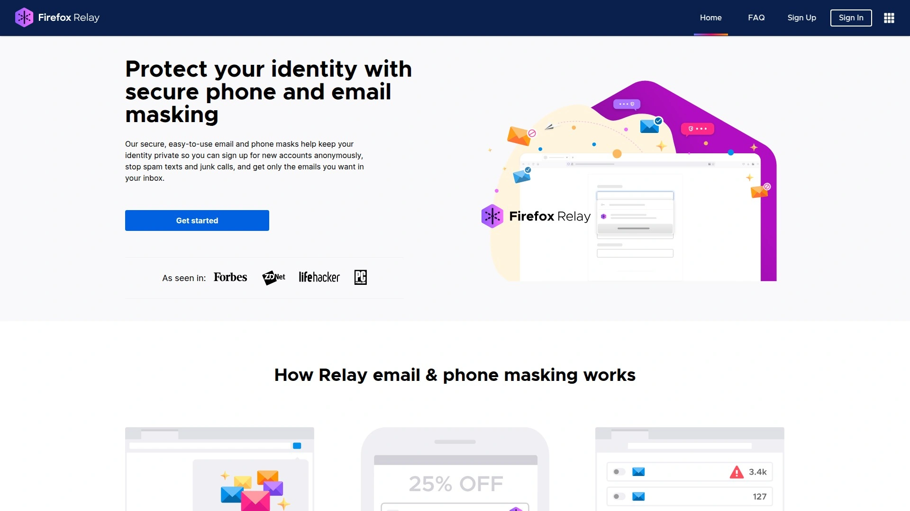

Firefox Relay offers email aliases and phone number masking (US only) with straightforward Mozilla-backed privacy. The free tier provides 5 email masks, while premium plans at $0.99 monthly give unlimited email aliases. Phone masking costs $4.99 monthly for one US number that forwards calls and texts. Email masks look like "random-word-1234@mozmail.com" and forward to your chosen inbox. When someone emails your mask, Relay can reply as if from that masked address, maintaining your anonymity. The browser extension auto-fills masks when signing up for sites. Integration with password managers like Bitwarden, 1Password, and others means you can generate masks without leaving your workflow. Relay's tracker removal feature strips tracking pixels and identifiers from forwarded emails before they reach your inbox. Phone masking provides a working number for SMS verification, incoming calls, and texts—perfect for marketplace transactions, deliveries, or any situation requiring a callback number you don't want keeping. You control which masks stay active and can disable any receiving spam with one click. The service emphasizes simplicity over features—no virtual cards, no password management, just focused email and phone protection. Mozilla's nonprofit structure and privacy-first reputation add trust compared to advertising-funded alternatives. Best for Firefox users wanting affordable, trustworthy masking without subscription complexity, or anyone needing basic phone number privacy for US-based interactions.

## **[SimpleLogin](https://simplelogin.io)**

Open-source email aliasing service now owned by Proton that provides unlimited aliases with reply masking and PGP encryption support.

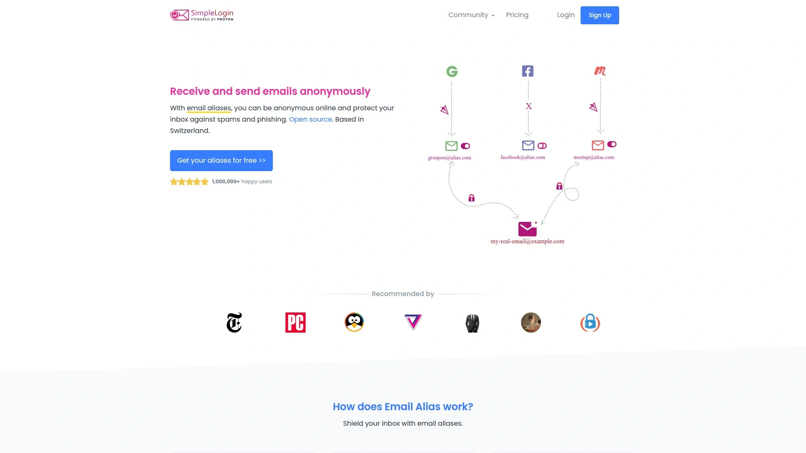

SimpleLogin operates as an open-source project acquired by Proton in 2022, maintaining independence while integrating with the Proton ecosystem. The free plan includes 10 aliases, while premium at $30 annually unlocks unlimited aliases, custom domains, and advanced features. Every alias forwards to your real inbox but appears as a unique sender when you reply, keeping your actual address hidden. PGP key support encrypts emails before forwarding, adding security layers competitors skip. Custom domain usage means aliases look like "anything@yourdomain.com" rather than generic service domains, improving professionalism while maintaining privacy. Directory feature creates catchall patterns like "shop@yourdomain.com" that automatically generate aliases for any incoming mail. Browser extensions for Chrome, Firefox, Safari, and Edge generate aliases on the fly during signups. Mobile apps keep alias management accessible anywhere. Integration with Proton Mail creates seamless workflows if you're already in that ecosystem. The reverse-alias feature lets you initiate emails from your aliases rather than just receiving, maintaining consistent identity. Subdomain support enables unlimited "label.name@yourdomain.com" variations for organization. API access allows developers to build custom integrations or automate alias creation. The open-source codebase means anyone can audit security and contribute improvements. Community-driven development responds to user needs faster than corporate structures. SimpleLogin emphasizes complete transparency about data handling and privacy practices. Best for privacy enthusiasts wanting open-source solutions, users needing PGP encryption, or anyone invested in the Proton privacy suite who wants unified email protection.

## **[Fastmail](https://fastmail.com)**

Australian email service with built-in masked email addresses, calendar, contacts, and fast, ad-free performance.

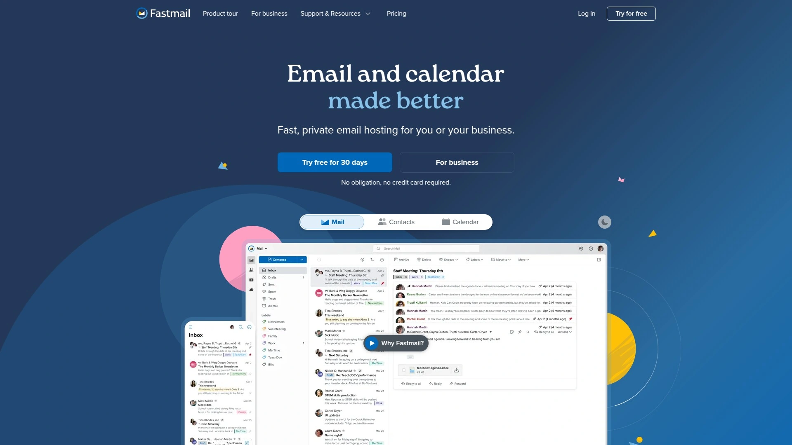

Fastmail provides masked email as part of its email hosting service starting at $3 monthly for the Basic plan, with Business tiers for teams. Masked addresses use random word combinations like "dog-food-3495@fastmail.com" or your custom domain for portable aliases. Each mask includes a description showing which service it's for, visible in your inbox so you instantly know who's contacting you. If "shadysite.com" pretends to be your bank, the mask label reveals the impersonation. Integration with 1Password and Bitwarden enables automatic mask generation during account creation in those password managers. Unlike competitors that just forward, Fastmail's masks work as proper email addresses you can send from, organize, filter, and manage like any mailbox. The calendar and contacts management round out the productivity suite beyond pure privacy. Custom domain support means aliases remain yours even if you switch providers later—no lock-in to Fastmail's domains. Masked addresses appear with special icons in the interface making them easy to spot and manage. Fast performance without Google-style tracking or advertising makes it appealing for productivity-focused users. The Masked Email page in settings shows all your aliases with labels, enabling easy auditing of which services have which addresses. Storage ranges from 2GB on Basic plans to 600GB on Advanced tiers. Best for users wanting email masking integrated into a full-featured email service rather than a standalone privacy tool, particularly those already seeking Gmail alternatives for speed and ethics reasons.

## **[DuckDuckGo Email Protection](https://duckduckgo.com)**

Free email protection service from the privacy search engine that removes trackers from forwarded emails and allows anonymous replies.

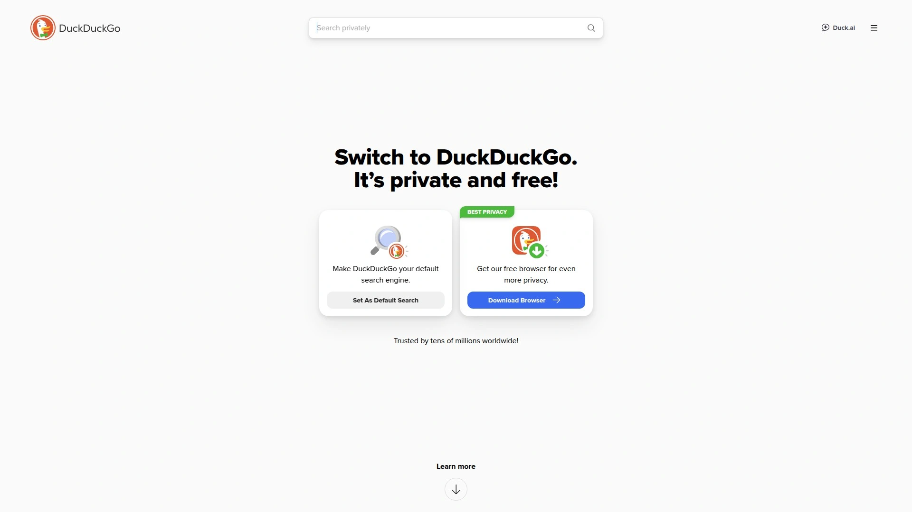

DuckDuckGo Email Protection provides unlimited "@duck.com" email addresses completely free with no premium tier. Request your custom "@duck.com" address through their website or mobile app, then generate unlimited randomized aliases like "random-word-123@duck.com" for different signups. When emails arrive at your alias, DuckDuckGo automatically strips tracking pixels, hidden images, and link trackers before forwarding to your real inbox. This tracker removal happens server-side so your email client never sees the surveillance code. Reply to any forwarded email and DuckDuckGo routes it through your alias address, maintaining anonymity—recipients only see your "@duck.com" alias. Browser extension integration with Bitwarden, Firefox, and others enables one-click alias generation during account creation. The service collects minimal data, just your phone number for initial verification. DuckDuckGo's reputation as the privacy-focused search engine adds credibility. The interface is intentionally simple—no complex dashboards or feature overload, just straightforward email protection. No attachment size limits beyond standard email protocols. Aliases can be disabled individually if they start receiving spam. The Privacy Pro bundle adds VPN and identity theft restoration services for users wanting comprehensive protection. Best for budget-conscious users who trust DuckDuckGo's privacy mission and want free, unlimited email protection without subscriptions or complicated setups.

## **[AnonAddy](https://anonaddy.com)**

Open-source email forwarding service with unlimited aliases, custom domains, and encryption options for maximum privacy control.

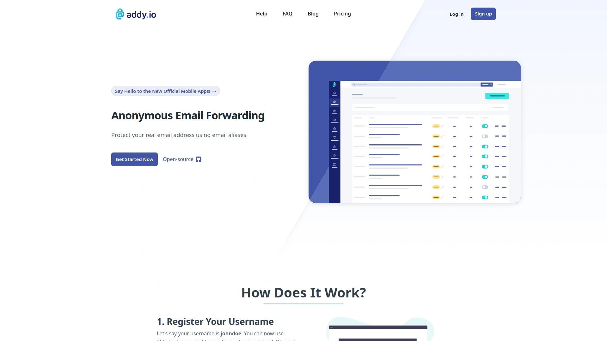

AnonAddy runs as an open-source alternative to commercial alias services with transparent operations. Free accounts get 20 shared domain aliases monthly, while the $12 annual Lite plan provides unlimited aliases with custom domains. The $36 yearly Standard plan adds multiple custom domains and extra features. Every alias forwards to your designated recipient address with optional PGP encryption applied before forwarding. Username aliases let you create unlimited addresses using your username like "myusername+anything@anonaddy.com" that all route to your inbox. Custom domains enable "anything@yourdomain.com" patterns with wildcard functionality. Reply tracking remembers conversations so responses route through the correct alias automatically. API access enables programmatic alias creation and management for technical users. Bandwidth monitoring tracks forwarded email volume. Failed delivery tracking shows when aliases receive mail that couldn't forward due to recipient issues. The service supports multiple recipient addresses so one alias can forward to different inboxes. Regex rules enable advanced filtering and routing logic. Email subject modification can replace or hide subjects for additional privacy. Self-hosting option available for users wanting complete infrastructure control. The open-source nature means full code transparency and community contributions. Best for privacy purists wanting complete control, technical users needing API access, or anyone seeking open-source alternatives to proprietary services.

## **[Privacy.com](https://privacy.com)**

Virtual card service creating unlimited single-use or merchant-locked credit cards to protect your real payment information from breaches and fraud.

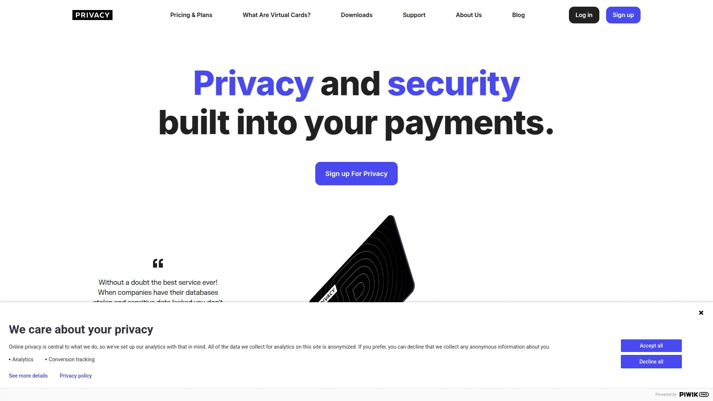

Privacy.com specializes in virtual credit card generation with free personal accounts creating up to 12 cards monthly. Pro plans at $10 monthly enable 36 cards with 1% cashback, while Premium at $25 monthly offers 60 cards with 1.5% cashback. Each virtual card ties to your bank account or debit card but uses unique 16-digit numbers that mask your actual financial information. Merchant locking means a card only works at one specific vendor—if stolen or leaked, it's useless elsewhere. Spend limits per card prevent overcharges on subscriptions or questionable merchants. Single-use cards close automatically after one purchase, perfect for free trials you want to expire without manual cancellation. The browser extension auto-fills virtual cards during checkout. PCI-DSS compliance and SOC 2 Type II certification demonstrate security standards. 256-bit encryption protects stored data. Privacy Cards show up on your bank statement as charges from Privacy.com, then detail the actual merchant in the Privacy dashboard. Transaction history tracks spending across all virtual cards in one interface. Pause any card instantly to prevent charges without closing it permanently. Mobile apps for iOS and Android enable card creation and management anywhere. The service makes money from merchant interchange fees rather than selling your data. Best for online shoppers wanting subscription control, anyone concerned about card number leaks, or users signing up for free trials without remembering to cancel before charges hit.

## **[MySudo](https://mysudo.com)**

Comprehensive privacy app providing multiple "Sudo" profiles with dedicated phone numbers, email addresses, and browsing for complete identity separation.

MySudo creates separate digital identities called Sudos, each with its own phone number, email address, and browsing container. Free accounts get one Sudo, while paid plans provide 3-9 Sudos depending on tier. Use one Sudo for work, another for online shopping, another for social media—completely compartmentalized digital lives. Each phone number functions fully for calls, texts, and verification, using VoIP technology. The numbers are real US and Canadian numbers that others can call and text normally. Email addresses work as complete inboxes within the app. The built-in browser isolates each Sudo's web activity from others, preventing cross-contamination of tracking cookies. Virtual cards in development will add payment masking to the suite. Photos and files can be stored within specific Sudos, keeping personal and business information separated. The app emphasizes end-to-end encryption for communications. No phone number or personal ID required to sign up—pseudonymous accounts protect your identity from MySudo itself. Subscription pricing starts around $0.99 monthly for basic plans, scaling to $15.99 for Premium with 9 Sudos and enhanced features. Best for users wanting complete identity separation rather than just email aliases, particularly those needing multiple working phone numbers for different life contexts without carrying multiple physical devices.

## **[Hushed](https://hushed.com)**

Second phone number app providing temporary or permanent private numbers for calls and texts without revealing your real number.

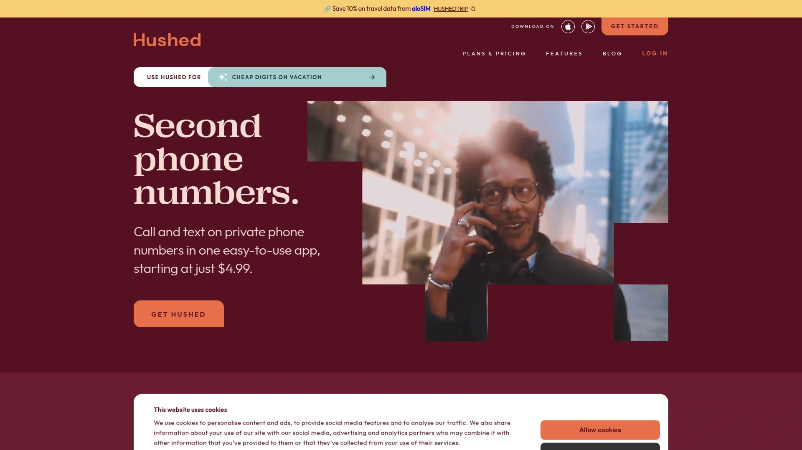

Hushed offers disposable phone numbers from 300+ area codes in over 60 countries. Plans range from 3-day numbers at $1.99 to permanent numbers with monthly subscriptions starting around $4.99. Each number works for incoming and outgoing calls and texts using WiFi or data—no cellular service required. Use Hushed numbers for Craigslist transactions, dating apps, business contacts, or any situation needing callback capability without personal exposure. Multiple numbers can be active simultaneously on different plans. The app masks your caller ID when making outbound calls, showing the Hushed number instead of your real one. Text messages support photos and group messaging. Voicemail transcription available on higher tiers. Call forwarding can route Hushed calls to your real number if preferred. Number porting isn't available, but you can keep Hushed numbers indefinitely with active subscriptions. The app works internationally over WiFi, giving you local numbers in foreign countries without international calling charges. Lower-tier plans throttle minutes and texts, while unlimited plans remove restrictions. Best for short-term needs like marketplace sales, online dating, or travel where you need legitimate callback numbers without long-term commitment or personal number exposure.

## **[DeleteMe](https://joindeleteme.com)**

Data broker removal service that manually requests deletion of your personal information from 750+ people-search sites and data brokers.

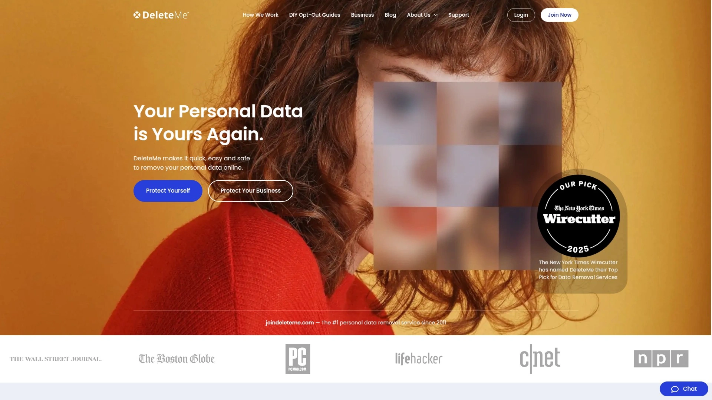

DeleteMe operates through expert privacy advisors who manually submit opt-out requests to data broker websites on your behalf. Plans start at $129 annually for individual coverage, with family plans protecting multiple people. The service covers 750+ data broker sites including major people-search platforms that sell your address, phone numbers, age, relatives, and property information. Quarterly reports detail which sites had your information and removal status. The manual approach contrasts with fully automated competitors—DeleteMe's team navigates each site's unique opt-out process, follows up on incomplete requests, and handles re-appearance monitoring. Coverage spans US sites comprehensively with some international broker support. The service emphasizes people-search sites and marketing data brokers but doesn't cover all broker categories like recruitment or financial information brokers that some competitors include. Custom requests allow adding sites beyond the standard 750+ list, though volume depends on your plan tier. The process takes time—initial removal sweeps require 1-2 months, with ongoing monitoring preventing data from reappearing. DeleteMe is owned by Abine, the same company behind IronVest, creating integration opportunities for users wanting comprehensive privacy protection. Best for users prioritizing manual expertise over automated speed, or anyone wanting proven track record since DeleteMe pioneered this service category.

## **[Incogni](https://incogni.com)**

Automated data broker removal service removing your information from 420+ brokers with unlimited custom requests on premium plans.

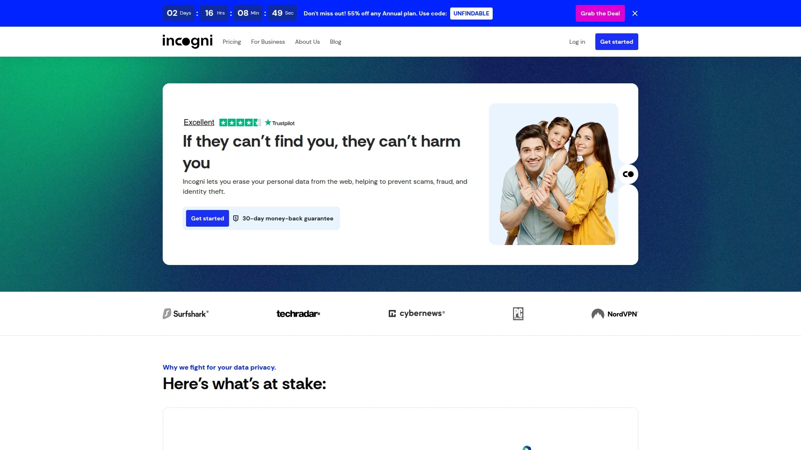

Incogni uses automated systems to submit removal requests across 420 data broker sites with plans starting at $6.49 monthly when paid annually. The service covers people-search sites, marketing brokers, risk mitigation brokers, recruitment data brokers, and financial information brokers—broader category coverage than competitors focusing only on people-search and marketing. Automated requests mean faster initial processing compared to manual services. Dashboard tracking shows real-time removal progress with before-and-after views of how your data appeared on broker sites. Unlimited custom requests on premium plans let you add brokers beyond the standard 420, with Incogni claiming 1,420+ total removals including customs. The automation enables weekly or monthly re-scans to catch data reappearance immediately. Incogni is owned by Surfshark, the VPN company, creating bundle opportunities for comprehensive privacy protection. The service works in both US and European markets. Reports arrive more frequently than quarterly services, with some users receiving monthly updates. Best for users wanting faster automated processing, broader broker category coverage beyond just people-search sites, or anyone already using Surfshark VPN who wants unified privacy management.

## **[Optery](https://optery.com)**

Data removal service providing monthly reports with screenshots showing exactly how your data appears on broker sites before removal.

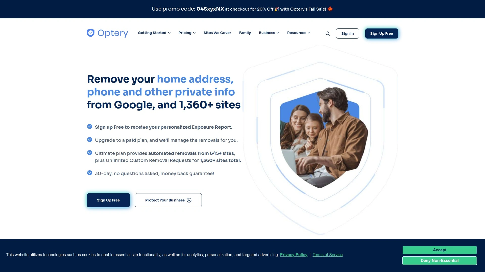

Optery removes information from data brokers with focus on transparency through detailed reporting. Plans start at $9.95 monthly for 20 broker sites, scaling to $274.95 annually for 240+ sites with family coverage. The standout feature is screenshot documentation—monthly reports include actual images of your profiles on data broker sites so you see precisely what information was exposed and verify its removal. This contrasts with competitors providing simple status updates without visual proof. Optery's research team determined that many competitors claiming 750+ sites actually place removal burden on customers through "custom requests" rather than handling everything themselves. Optery automates all removals included in your plan without requiring customer action. The monthly reporting frequency keeps you updated more regularly than quarterly services. Integration with security tools provides holistic privacy management. Opt-out automation handles the tedious process of navigating each site's unique removal procedures. Best for users wanting visual confirmation of what data brokers had and proof of removal, or anyone skeptical of services that claim high numbers without transparency about their removal methods.

## **[Aura](https://aura.com)**

All-in-one identity theft protection combining credit monitoring, dark web scanning, VPN, antivirus, and password manager starting at $12 monthly.

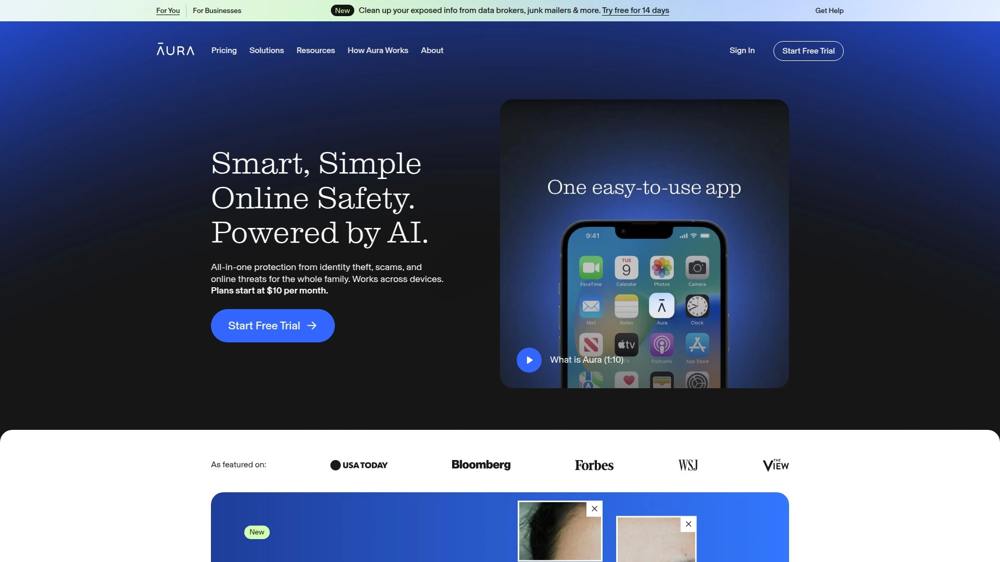

Aura bundles identity theft protection with cybersecurity tools in unified pricing. Individual plans start at $12 monthly when paid annually, while family plans at $32 monthly cover up to 5 adults and unlimited children. Three-bureau credit monitoring from Experian, Equifax, and TransUnion comes standard across all plans. Dark web monitoring scans for your SSN, email, phone, and other personal data on criminal marketplaces. Real-time alerts notify within 5 minutes of threat detection. The platform includes built-in VPN for secure browsing, antivirus software, and password manager—no need for separate subscriptions. Parental controls and child identity monitoring protect family members. $1 million identity theft insurance covers stolen funds, legal fees, and personal expenses if fraud occurs. White-glove fraud resolution specialists assist with recovery if your identity gets stolen. Financial account monitoring watches bank and credit card transactions for suspicious activity. The interface unifies all features in one dashboard rather than juggling multiple apps. Aura emphasizes ease of use and fast response times over feature quantity. Best for families wanting comprehensive protection without managing multiple services, or individuals seeking affordable all-in-one identity theft protection with built-in security tools.

## **[Norton LifeLock](https://lifelock.norton.com)**

Industry veteran identity theft protection backed by Norton 360 antivirus, offering up to $3 million insurance coverage on premium plans.

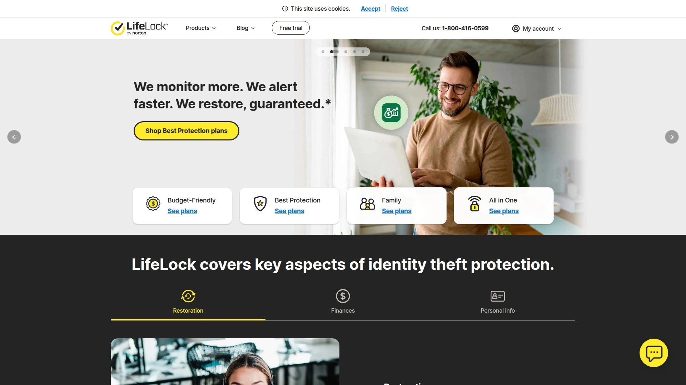

LifeLock pioneered identity theft protection and remains an industry leader with 80+ million users. Plans start at $9.99 monthly for Standard (one adult), scaling to $34.99 monthly for Ultimate Plus with Norton 360 bundle. The Ultimate Plus plan includes $1 million stolen funds reimbursement, $1 million personal expense coverage, and $1 million legal fees coverage. Norton 360 integration provides antivirus, firewall, password manager, VPN, and cloud backup in higher-tier plans. Social media monitoring scans your accounts for identity misuse. Three-bureau credit monitoring available on Select and higher plans. Investment account monitoring alerts you to suspicious activity in brokerage accounts. SSN and credit card monitoring tracks your sensitive data. Dark web monitoring searches criminal marketplaces. Sex offender registry monitoring alerts if offenders move near your address. The Norton name brings trusted security expertise. Annual billing reduces costs significantly compared to monthly. Family plans protect two adults and five children. The main criticism is complex pricing with valuable features locked in expensive tiers. Best for users wanting maximum insurance coverage, those already trusting Norton security products, or anyone willing to pay premium prices for established brand reputation and comprehensive protection.

## **[Identity Guard](https://identityguard.com)**

AI-powered identity theft protection with IBM Watson technology providing predictive risk analysis and comprehensive credit monitoring.

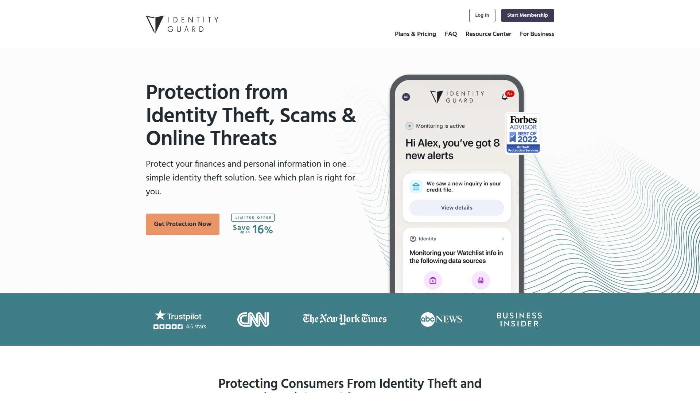

Identity Guard uses IBM Watson artificial intelligence to analyze identity theft risks and predict potential fraud before it happens. Plans start at $8.99 monthly for Value (single bureau), $19.99 for Total (three bureaus), and $24.99 for Ultra (adds more features). The AI monitors hundreds of data points creating risk scores that highlight vulnerabilities. Three-bureau credit monitoring on Total and Ultra plans tracks Experian, TransUnion, and Equifax. Dark web monitoring searches for your data on criminal sites. Credit and debit card monitoring watches for suspicious transactions. Monthly credit score tracking shows changes over time. Change of address monitoring alerts you if someone tries redirecting your mail. Court records monitoring detects identity misuse in legal proceedings. $1 million identity theft insurance covers all plans. Fraud resolution specialists provide white-glove assistance if theft occurs. Mobile app keeps protection accessible anywhere. Identity Guard emphasizes proactive risk detection rather than reactive alerts. Best for users wanting AI-powered predictive analysis, anyone interested in technology-enhanced protection, or individuals seeking strong three-bureau credit monitoring at reasonable prices.

## **[IDShield](https://idshield.com)**

Identity theft protection with unlimited consultations from identity theft experts and flat pricing across all plans.

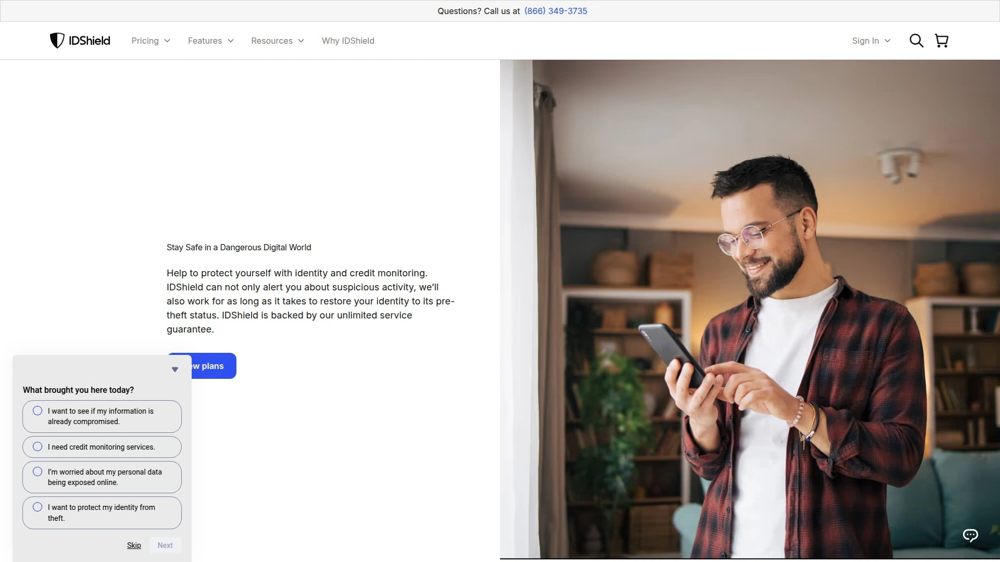

IDShield provides identity theft protection starting at $19.95 monthly for individuals or $34.95 for families. All plans include the same features—no confusing tiers or add-ons. Three-bureau credit monitoring tracks Experian, TransUnion, and Equifax. SSN monitoring alerts if your number appears in suspicious contexts. Dark web monitoring searches criminal marketplaces. Public records monitoring watches court records and criminal databases. Social media monitoring scans for identity misuse or reputation damage. Change of address monitoring detects mail redirection attempts. Unlimited consultations with identity theft experts differentiate IDShield—most competitors limit expert access or charge extra. Up to $3 million identity theft insurance covers all plans. Licensed private investigators assist with fraud resolution if needed. Family plans cover two adults and unlimited children under 18. The flat pricing eliminates decision paralysis about which tier to choose. IDShield is offered through LegalShield, a legal services company, creating potential bundle value. Best for users wanting expert access without limits, families with multiple children to protect, or anyone preferring straightforward pricing over tiered options.

## **[Surfshark Alternative ID](https://surfshark.com)**

Email masking service bundled with Surfshark VPN in the One and One+ plans, providing masked addresses with centralized management.

Surfshark Alternative ID generates masked email addresses that forward to your primary email, protecting your real address from exposure. The feature comes bundled with Surfshark VPN in the One plan ($3.19 monthly) or One+ plan ($5.09 monthly when paid for 24 months). Seamless integration with Surfshark's interface means managing masks alongside VPN settings in unified dashboard. Generate masked emails during signups to prevent spam, phishing, and data leaks. Each service gets unique address so breaches are contained. Enable or disable aliases instantly from the control panel. Delete aliases that start receiving spam without affecting your primary email. The VPN component provides additional privacy by masking your IP address and encrypting internet traffic. Antivirus in One+ plans adds malware protection. Alert system notifies you of email breaches. The bundled approach offers value for users wanting comprehensive privacy tools rather than standalone email masking. Best for existing Surfshark VPN users wanting to add email protection, or anyone seeking VPN and email masking in affordable package.

## **[NordPass Email Masking](https://nordpass.com)**

Password manager with integrated email masking that generates unique addresses to prevent data exposure and spam.

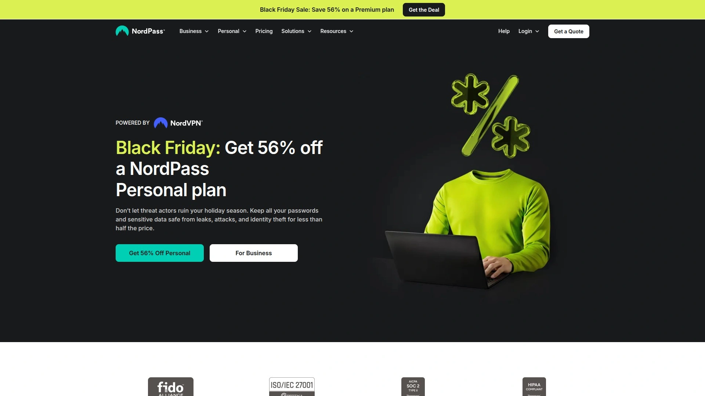

NordPass includes email masking in its password manager starting at $1.49 monthly when paid for 2 years. The feature generates unique email addresses for online signups that forward to your real inbox while keeping it private. Corporate version protects business email addresses from exposure. Integration with the password manager means generating masked emails without leaving the autofill flow during account creation. Each login stored in NordPass can have dedicated masked email, organizing your aliases alongside passwords. The password manager includes standard features like autofill, password generator, data breach scanning, and secure item sharing. Password health reports identify weak, reused, or compromised credentials. XChaCha20 encryption protects vault data. Zero-knowledge architecture ensures NordPass cannot access your stored information. Multi-factor authentication adds login security. Emergency access lets trusted contacts reach your vault if needed. The email masking prevents linking your activity across websites since each gets unique address. Best for users wanting password management and email masking integrated in single tool, or anyone in the Nord ecosystem (NordVPN, NordLocker) seeking unified privacy solutions.

## **[Proton Pass](https://proton.me/pass)**

Password manager from encrypted email provider Proton, with SimpleLogin integration for unlimited email aliases and hide-my-email functionality.

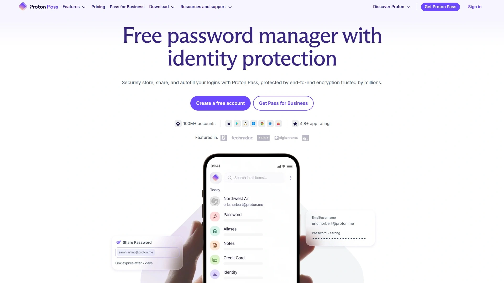

Proton Pass provides password management starting free with limited features, or $3.99 monthly for Proton Unlimited including 500GB storage, Proton Mail, Proton VPN, Proton Drive, and Proton Calendar. The password manager includes autofill, password generator, secure notes, and 2FA code generator. SimpleLogin integration (Proton acquired them) provides unlimited email aliases on paid plans, directly creating aliases within Proton Pass during account signups. Hide-my-email functionality generates random aliases instantly. The unified Proton ecosystem means vault unlocks grant access to encrypted email, cloud storage, and VPN simultaneously. End-to-end encryption protects all data with zero-knowledge architecture. Open-source code enables security audits. Swiss jurisdiction provides strong privacy laws. Data breach monitoring alerts you to compromised credentials. Passkey support enables passwordless authentication where supported. Item sharing allows secure credential sharing with other Proton Pass users. Best for users already in Proton ecosystem wanting unified privacy tools, anyone prioritizing open-source and Swiss privacy laws, or individuals seeking comprehensive email and password protection from trusted provider.

## **[1Password](https://1password.com)**

Premium password manager with family sharing, Travel Mode, and Watchtower security monitoring at $2.99 monthly for individuals.

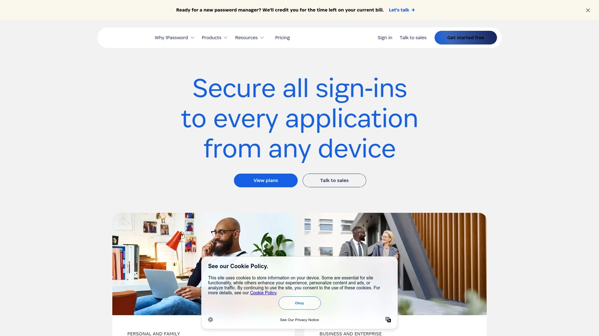

1Password emphasizes both security and usability with clean interfaces across all platforms. Individual plans cost $2.99 monthly while family plans at $4.99 cover 5 people. The password manager stores unlimited items including passwords, credit cards, secure notes, documents, and identity information. Autofill works across desktop and mobile with browser extensions. Password generator creates strong credentials. Watchtower monitors for compromised passwords, weak credentials, and two-factor authentication opportunities. Travel Mode lets you remove sensitive vaults before crossing borders, then restore them after. Secret Key technology adds security layer beyond master password. Family organizer enables sharing specific vaults while keeping others private. Guest accounts provide limited access to shared items. 1GB document storage per person. Activity log tracks vault access. The company never had data breaches. Integration with numerous platforms and services makes workflows seamless. Best for families wanting easy credential sharing, frequent travelers needing border security, or users prioritizing polished interfaces and established reputation.

## **[Bitwarden](https://bitwarden.com)**

Open-source password manager with free unlimited password storage and affordable premium features starting at $0.83 monthly.

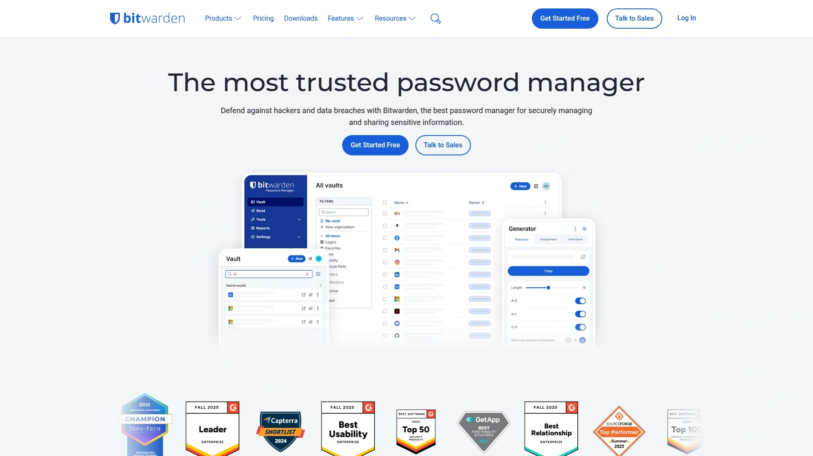

Bitwarden's open-source codebase allows anyone to audit security and verify zero-knowledge architecture. Free accounts include unlimited password storage, unlimited devices, and core password manager features. Premium at $10 annually ($0.83 monthly) adds 1GB encrypted file storage, advanced 2FA options, emergency access, and security reports. Family plans at $40 yearly cover 6 users with share
